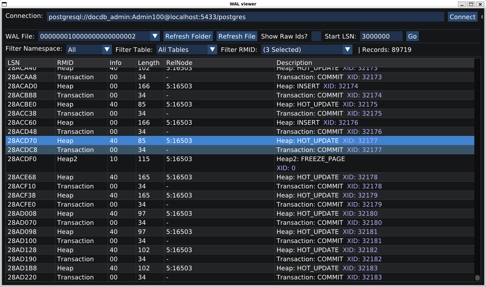

# PostgreSQL WAL Viewer

A specialized viewer for PostgreSQL Write-Ahead Log (WAL) files, built using Dear ImGui. This tool allows users to inspect WAL records, filter them, and understand the internal operations of their PostgreSQL database.



## Features

- **Automatic File Loading**: Automatically loads the first WAL file found in the `pg_wal` directory.
- **Hex Editor View**: Detailed hex view of WAL content.
- **Record Parsing**: Decodes WAL records to show LSN, XID, Resource Manager, and Length.
- **Filtering**:
  - Filter records by LSN range (automatically focused on the active file's range).
  - Search/Filter by record type.
- **Navigation**:
  - Jump to specific offsets.
  - Keyboard navigation support.,
- **Visual Enhancements**:
  - Highlighted WAL records.
  - Read-only mode for safety.
  - Responsive layout.

## Building the Project

### Prerequisites
- CMake (version 3.10 or higher)
- Make (optional, for Makefile usage)
- A C++ compiler (GCC or Clang)
- Dependencies (often included or fetched):
  - GLFW
  - OpenGL
  - Dear ImGui (included in source)

### Build Instructions

1.  **Clone the repository** (if you haven't already):
    ```bash
    git clone <repository_url>
    cd wal_viewer
    ```

2.  **Create a build directory**:
    ```bash
    mkdir build
    cd build
    ```

3.  **Run CMake**:
    ```bash
    cmake ..
    ```

4.  **Build**:
    ```bash
    make
    ```

### Running the Application

After building, run the executable from the `build` directory:

```bash
./wal_viewer
```

Make sure you have a `pg_wal` directory accessible or configure the application to point to your WAL files.

## Usage

1.  **Launch**: the application will scan `pg_wal` and open the first available file.
2.  **Inspect**: Click on records in the parsed list to highlight their raw bytes in the hex editor.
3.  **Filter**: Use the input fields to filter by LSN or record type.

## License

MIT License
